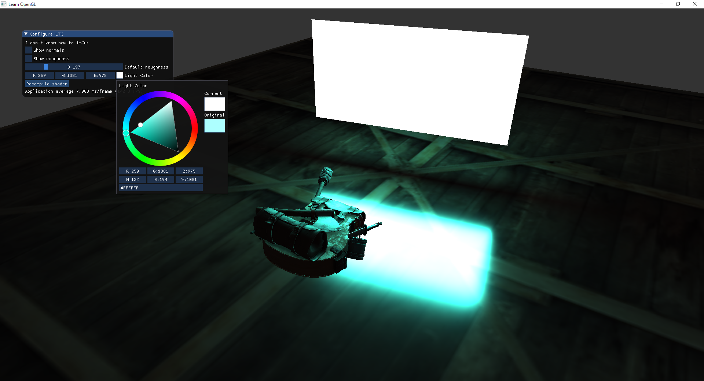

# Implementation of LTC on OpenGL

I added ImGui so you can mess around with it a bit.

- [LTC Paper](https://eheitzresearch.wordpress.com/415-2/)
- [WebGL demo](https://blog.selfshadow.com/sandbox/ltc.html) which I heavily took a lot of code from
    - I guess this code derives from [this repo](https://github.com/selfshadow/ltc_code/) which has a pretty comprehensive list of links as well

I Read these (I recommend reading them in this order):
1. [paper](https://drive.google.com/file/d/0BzvWIdpUpRx_d09ndGVjNVJzZjA/view)
1. [Geometric Derivation of the Irradiance of Polygonal Lights](https://hal.archives-ouvertes.fr/hal-01458129)
1. [Real-Time Area Lighting: a Journey From Research to Production](https://blog.selfshadow.com/publications/s2016-advances/)
1. [appendix matlab](https://drive.google.com/file/d/0BzvWIdpUpRx_Nk0wMk1iSGtZZzQ/view)
    - this is probably optional, I was trying to figure out how to get the matrix textures but it seems to have changed in the "in practice" slides so I'll try doing that instead

Haven't read yet:
- [appendix ggx](https://drive.google.com/file/d/0BzvWIdpUpRx_d3lJNEtVODlhZDQ/view)
- [appendix technicolor](https://drive.google.com/file/d/0BzvWIdpUpRx_Qld6Sl9BaU1IN2M/view)
- [linear-light shading with LTCs](https://blogs.unity3d.com/2017/04/17/linear-light-shading-with-linearly-transformed-cosines/)
- [real time line and disk lighting](https://blog.selfshadow.com/publications/s2017-shading-course/)
