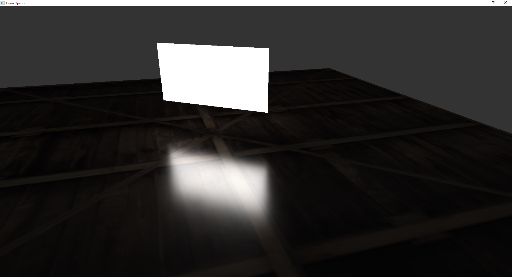

# Implementation of LTC on OpenGL

[LTC](https://eheitzresearch.wordpress.com/415-2/)
[WebGL demo](https://blog.selfshadow.com/sandbox/ltc.html)

Read:
- [paper](https://drive.google.com/file/d/0BzvWIdpUpRx_d09ndGVjNVJzZjA/view)
- [appendix matlab](https://drive.google.com/file/d/0BzvWIdpUpRx_Nk0wMk1iSGtZZzQ/view)

Haven't read yet:
- [appendix ggx](https://drive.google.com/file/d/0BzvWIdpUpRx_d3lJNEtVODlhZDQ/view)
- [appendix technicolor](https://drive.google.com/file/d/0BzvWIdpUpRx_Qld6Sl9BaU1IN2M/view)
