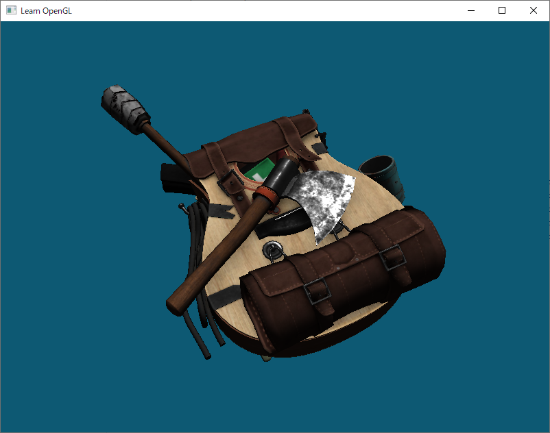

# OpenGL Stuff

For now starting off by following [Learn OpenGL](https://learnopengl.com/).

Required libraries:
- glfw3
- assimp

(Find source and compile yourself or find binaries to link to them.)
